[Задание](https://github.com/netology-code/virtd-homeworks/blob/shvirtd-1/05-virt-05-docker-swarm/README.md)

## Задача 1 Создайте ваш первый Docker Swarm-кластер в Яндекс Облаке. 
### 1. Создать 3 ВМ в одной сети: 
#### Вариант 1
- Пишем [bash скрипт](create_yandex_vm)

- Запускаем  
`./create_yandex_vm`

- Проверяем в Yandex консоли:  
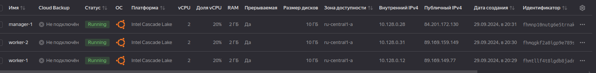

### 2. Установить docker на каждую ВМ: 

- Пишем [ansible playbook](ansible/playbook.yaml) и конфигурим [hosts](ansible/hosts)
- Из папки ansible запускаем   
`ansible-playbook -i hosts --private-key ~/.ssh/id_ed25519.pub playbook.yaml`

- Проверяем:  
manager:  
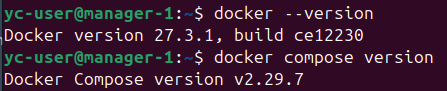
worker1:  
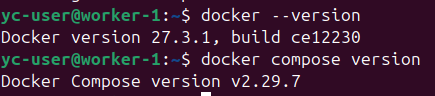
worker2:  
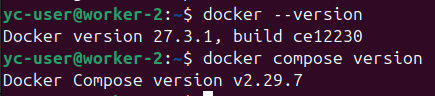

#### Вариант 2 пп.1 и 2:
- Создаём образ уже с докером:  
[ubuntu-template.json](packer/ubuntu-template.json)
- Конфигурим переменные  
[variables.json](packer/variables_example.json)
- Запускаем  
`packer build --var-file=variables.json ubuntu-template.json`
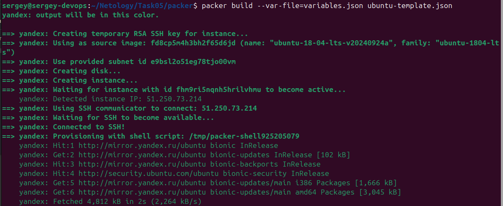
- Проверяем наличие образа:  
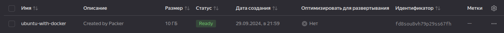

- Меняем переменную окружения в `create_yandex_vm` на наш образ

- Запускаем `./create_yandex_vm`
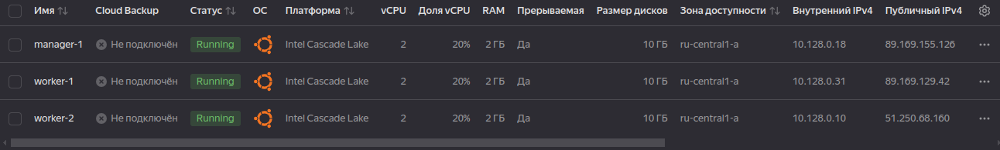

- Проверяем наличие docker:  
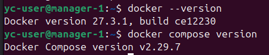
Аналогично на остальных машинах.

### 3. Создать swarm-кластер из 1 мастера и 2-х рабочих нод.

- На manager машине выполняем:  
`docker swarm init --advertise-addr 10.128.0.18`
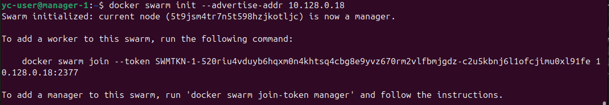

- На workers машинах выполняем:  
`docker swarm join --token SWMTKN-1-520riu4vduyb6hqxm0n4khtsq4cbg8e9yvz670rm2vlfbmjgdz-c2u5kbnj6l1ofcjimu0xl91fe 10.128.0.18:2377`

### 4. Проверяем список нод:
`docker node ls`  
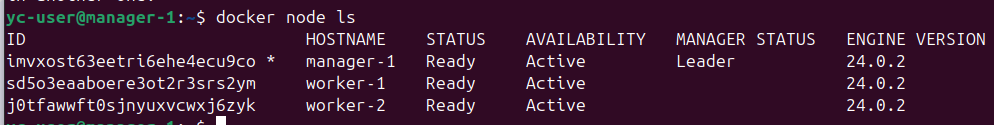

## Задача 2 Deploy python приложения:

- Переводим [install_app.sh](install_app.sh) с Centos на Ubuntu
- Копируем на ВМ менеджера:
`scp install_app.sh yc-user@89.169.155.126:/home/yc-user`
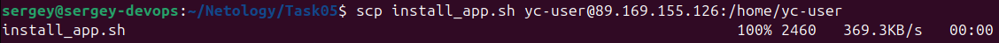

- Запускаем на машине менеджера:
`sudo ./install_app.sh`  
Получаем сообщение:  
`(root) Additional property include is not allowed`  
Выяснилось, что:  
`docker stack is not docker compose. While it relies on compose file it did not adopted the compose specification so is stuck with the legacy version: 3 format of the compose file. Any recent compose syntax will be rejected`  
[Источник](https://github.com/docker/cli/issues/4740)  
Потому в проректе создаём compose-swarm.yaml на базе compose.yml, коммитим, пушим, меняем запуск деплоя в `install_app.sh`:  
`docker stack deploy -c compose-swarm yaml python_app`  
заново копируем на manager и снова запускаем:

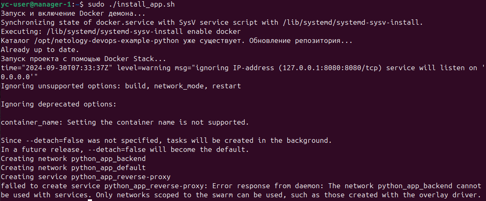

Выяснились другие ограничения:  
`Ignoring unsupported options: build, network_mode, restart`  
То есть, для запуска этого проекта необходимо создать готовый образ с этим проектом.
Попытка закончилась неудачей.

## Задача 3: Запуск стека микросервисов
- Создаём новый файл compose-microservices.yaml с примером из лекции и с добавлением portainer
- Копируем на сервер и запускаем:  
`docker stack deploy -c compose-microservices.yaml microservices`

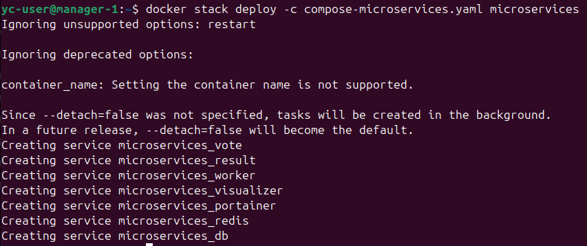

- Проверяем portainer на всех ip, вот пример worker:
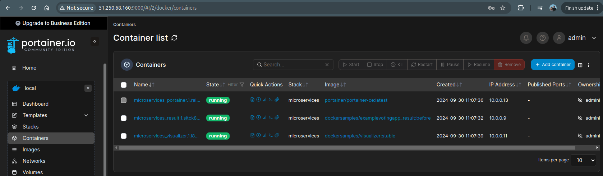

